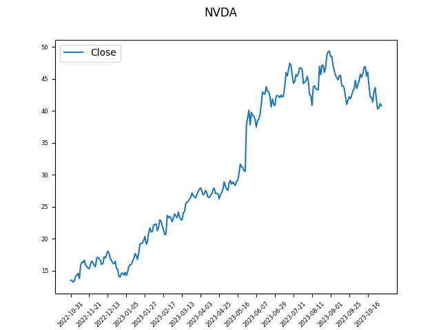

# python-pandas-graph

Stock price can be download from yahoo finance, but the result will only be in 
JSON format:

For example, the TSLA stock price JSON can be downloaded using the following
URL: 
https://query1.finance.yahoo.com/v7/finance/chart/TSLA?period1=1667246938&period2=1698782938&interval=1d&events=history&includeAdjustedClose=true 

You will need to make use of the `requests` library to get the data from yahoo finance, below 
is a code snippet to help you.

```python
>>> import requests
>>> url = 'https://query1.finance.yahoo.com/v7/finance/chart/TSLA?period1=1667246938&period2=1698782938&interval=1d&events=history&includeAdjustedClose=true'
>>> # We need to provide the headers dictionary because yahoo 
>>> # doesn't like us using python
>>> response = requests.get(url, headers={'User-Agent': 'MyCustomUserAgent/1.0'} )
>>> response.json()
{'chart': {'result': [{'meta': {'currency': 'USD', 'symbol': 'TSLA', 'exchangeName': 'NMS', 'fullExchangeName': 'NasdaqGS', 'instrumentType': 'EQUITY', 'firstTradeDate': 1277818200, 'regularMarketTime': 1729538581, 'hasPrePostMarketData': True, 'gmtoffset': -14400, 'timezone': 'EDT', 'exchangeTimezoneName': 'America/New_York', 'regularMarketPrice': 217.94, 'fiftyTwoWeekHigh': 220.48, 'fiftyTwoWeekLow': 215.726, 'regularMarketDayHigh': 220.48, 'regularMarketDayLow': 215.726, 'regularMarketVolume': 41323395, 'longName': 'Tesla, Inc.', 'shortName': 'Tesla, Inc.', 'chartPreviousClose': 227.54, 'priceHint': 2, 'currentTradingPeriod': {'pre': {'timezone': 'EDT', 'start': 1729497600, 'end': 1729517400, 'gmtoffset': -14400}, 'regular': {'timezone': 'EDT', 'start': 1729517400, 'end': 1729540800, 
...
```

Please note that period1 and period2 on the above URL is formatted using UNIX timestamp format (https://en.wikipedia.org/wiki/Unix_time).  

To get the current timestamp in python, use the following code:

```python
@env3d ➜ /workspaces/python-pandas-graph (main) $ python
Python 3.12.1 (main, Oct 16 2024, 18:21:33) [GCC 9.4.0] on linux
Type "help", "copyright", "credits" or "license" for more information.
>>> import time
>>> timestamp = int(time.time())
>>> timestamp
1729535290
``` 

To get the timestamp on a specific date/time, use the following code:
```python
>>> import time
>>> import datetime
>>>
>>> # Create a datetime object for the specific date
>>> specific_date = datetime.datetime(2023, 10, 21, 12, 0, 0)  # Year, Month, Day, Hour, Minute, Second
>>> 
>>> # Convert the datetime object to a Unix timestamp
>>> timestamp = int(time.mktime(specific_date.timetuple()))
>>> print(timestamp)
1697889600
```

You can create graphs easily using the following command (assuming you have
the file TSLA.csv).

```python
>>> import pandas
>>> # change the path_to_plot to your web directory
>>> path_to_plot = "tsla.png"
>>> df = pandas.read_csv('TSLA.csv')
>>> # Here we pick the columns we like to plot
>>> df[ ['Date', 'Close'] ].plot().get_figure().savefig(path_to_plot)
```

You can now access the plot as a png file.

Using the above knowledge, create a script called `graph.py`.
The script takes one argument, the stock ticker symbol, and outputs an image 
called ${TICKER}.png.  The data will be of the previous year from today. 

```shell
$ ls
example.png  graph.py  README.md
$ python3 graph.py
Error: Need to provide a ticker symbol
$ python3 graph.py RDD
Error: cannot get data from symbol
$ python3 graph.py MSFT
@env3d ➜ /workspaces/python-pandas-graph (main) $ ls
example.png  graph.py  MSFT.png  README.md
@env3d ➜ /workspaces/python-pandas-graph (main) $ 
```

HINTS:
 - Review https://www.linkedin.com/learning/data-ingestion-with-python/making-http-calls to figure out
 how to make http calls with python.  
 - Read the documentation on DataFrame.plot https://pandas.pydata.org/docs/reference/api/pandas.DataFrame.plot.html
 - matplotlib (the library that pandas use to create graphs) https://matplotlib.org/stable/api/figure_api.html so that the graph is properly labeled (i.e. proper title, axis labels, etc.)
 - You will need to work with how to create timestamps in python.  You may need to work with the following
 modules:
   - time
   - datetime
   - pandas.Timestamp

Here's the example output:



